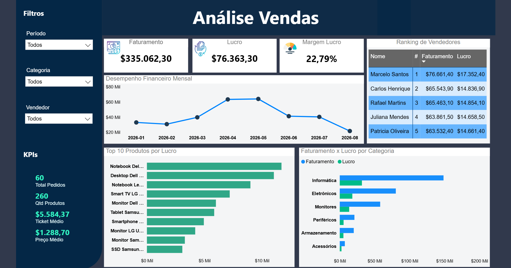

# 📊 TechStore Brasil — Análise de Vendas

Projeto de Business Intelligence desenvolvido para análise de vendas de uma empresa fictícia de tecnologia.

O projeto foi construído utilizando **PostgreSQL, SQL e Power BI**, passando pelas etapas de modelagem do banco de dados, tratamento e análise dos dados, criação de indicadores e desenvolvimento de um dashboard interativo.

## 🚀 Dashboard Interativo

👉 [Acessar Dashboard Interativo no Power BI](https://app.powerbi.com/view?r=eyJrIjoiNjZkN2EyODUtNmNjZi00N2E4LWFhODQtOTBlZjNlMzdkODcxIiwidCI6Ijc5ODQ4YTQzLTY3YjctNGYxNC05OWEwLWViOGRkZDkzMjFiNyJ9)

O dashboard permite explorar os dados através de filtros de:

- Período
- Categoria
- Vendedor

Também apresenta indicadores de faturamento, lucro, margem, pedidos, quantidade de produtos e ticket médio.

## 🖼️ Dashboard



## 🛠️ Tecnologias utilizadas

- **PostgreSQL** — criação e armazenamento do banco de dados
- **SQL** — consultas, relacionamentos, agregações e criação de views
- **Power BI** — modelagem, DAX e visualização dos dados
- **DAX** — criação dos principais indicadores
- **GitHub** — versionamento e documentação do projeto

## 🗄️ Banco de Dados

O banco de dados foi desenvolvido em modelo relacional e possui as seguintes entidades principais:

- Cliente
- Endereço
- Telefone
- Vendedor
- Produto
- Categoria
- Pedido
- Itens do Pedido

Uma view consolidada (`vw_vendas`) foi criada para facilitar a análise dos dados no Power BI.

## 📐 Modelagem no Power BI

O modelo analítico foi estruturado seguindo uma abordagem semelhante ao **modelo estrela**, utilizando:

### Tabelas de dimensão

- `D_Calendario`
- `D_Cliente`
- `D_Vendedor`
- `D_Produto`
- `D_Categoria`

### Tabela fato

- `vw_vendas`

As dimensões são relacionadas à tabela de vendas para permitir análises e filtros de forma estruturada.

## 📈 Principais indicadores

O dashboard apresenta:

- **Faturamento Total:** R$ 335.062,30
- **Lucro Bruto:** R$ 76.363,30
- **Margem de Lucro:** 22,79%
- **Total de Pedidos:** 60
- **Quantidade de Produtos Vendidos:** 260
- **Ticket Médio:** R$ 5.584,37
- **Preço Médio:** R$ 1.288,70

## 📊 Análises realizadas

O dashboard apresenta análises como:

- Evolução do faturamento ao longo dos meses
- Desempenho financeiro mensal
- Ranking de vendedores
- Top 10 produtos por lucro
- Faturamento e lucro por categoria
- Análise através de filtros interativos

## 🎯 Objetivo do projeto

O objetivo é demonstrar, de forma prática, conhecimentos em:

- Modelagem de dados
- Banco de dados relacional
- SQL
- PostgreSQL
- Power BI
- Modelagem dimensional
- DAX
- Construção de dashboards
- Análise e interpretação de indicadores de negócio

## 📁 Estrutura do projeto

```text
TechStore-Brasil-BI/
│
├── dashboard.png
│
├── Power BI/
│ └── TechStore_Brasil.pbix
│
├── PostgreSQL/
│ ├── criacao_tabelas.sql
│ ├── insercao_dados.sql
│ └── views.sql
│
└── README.md
